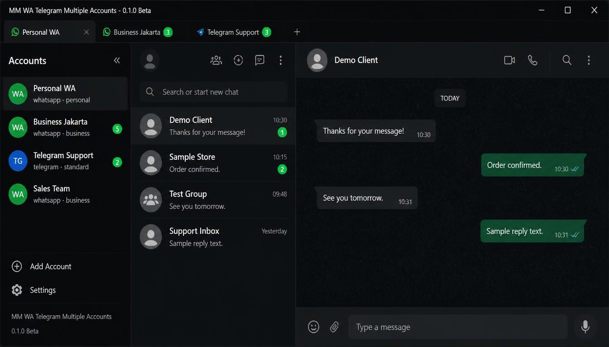

# MM WA Telegram Multiple Accounts

<p align="center">
  
</p>

<p align="center">
  
</p>

<p align="center"><em>Dark mode (v0.1.0 Beta) — demo contacts and messages only.</em></p>

Desktop application to manage multiple **WhatsApp Personal**, **WhatsApp Business**, and **Telegram** accounts from one window.

This is **not** an official WhatsApp, Meta, or Telegram product. It hosts the official web clients inside isolated Electron sessions on your PC.

**Repository:** [github.com/hardawebpro/mm-wa-telegram-multiple-accounts](https://github.com/hardawebpro/mm-wa-telegram-multiple-accounts) · **Beta:** `0.1.0-beta`

---

## English

### Features

- Multiple WA/TG accounts with separate login sessions
- Sidebar (expanded/compact), tabs with **WhatsApp/Telegram platform icons**, per-account settings
- **Desktop notifications** from the app shell (WhatsApp/Telegram web toasts are blocked to avoid duplicates); optional message preview; click to restore from tray and open the chat
- Unread badges on sidebar and tabs
- **Font size** presets (XS / S / M / L) for the app shell
- **Settings → About** — version, portable app info, **Report a bug on GitHub**
- **Voice and video calls** (when WhatsApp Web / Telegram Web supports them; configurable per account)
- Minimize to system tray (optional)
- Sessions persist after restart
- **Free and open source** (MIT) — beta release (`0.1.0-beta`)

**Notifications:** Enable per account under **Settings → Accounts**. Toggle **Notification preview** for chat name and message text. Launch the app from the **Desktop or Start Menu shortcut** (not `npm run dev`) so Windows shows the proper app name on toasts.

**Calls:** Enable or disable **Voice calls** and **Video calls** under **Settings → Accounts → Account Settings**. Also allow microphone/camera in Windows **Privacy & security** settings if prompted.

### Tech stack

| Layer | Technology |
|-------|------------|
| Desktop | Electron 34 |
| Build | electron-vite, Vite 5 |
| UI | React 18, TypeScript 5.7, Tailwind CSS 4 |
| Validation | Zod |
| Messaging | Official WhatsApp Web + Telegram Web via `WebContentsView` |

### System requirements

| Requirement | Details |
|-------------|---------|
| OS | **Windows 10** (64-bit) or newer |
| Node.js | **20 LTS** or **22 LTS** ([nodejs.org](https://nodejs.org/)) |
| npm | 10+ (included with Node.js) |
| RAM | 4 GB minimum recommended |
| Disk | ~500 MB+ for `node_modules` |
| Terminal | Command Prompt, PowerShell, or Windows Terminal — **no Git or IDE required** |

### Quick start (recommended for most users)

1. **Download** this repository as ZIP from GitHub and **extract** to a folder you can write to (e.g. `Documents\MM-WA-Telegram`).
2. **Install Node.js LTS** once from [nodejs.org](https://nodejs.org/). Close and reopen any open terminal after install.
3. Open the project folder and **double-click** `setup-first-time.bat`.
4. **Desktop** and **Start Menu** shortcuts are created automatically (Start Menu registration fixes the Windows notification app name).
5. **Launch from either shortcut** (recommended) — no terminal window.
6. Click **Add Account**, choose platform, scan QR or sign in to Telegram.

**Do not** copy launcher files to the Desktop alone — they must stay in the project folder. Shortcuts use `start-app.vbs` (hidden). Use `start-app.bat` if you want a visible terminal for debugging. For correct desktop notifications, prefer shortcuts over `npm run dev`.

### Manual setup (Command Prompt)

```cmd
cd /d C:\path\to\mm-wa-telegram-multiple-accounts
setup-first-time.bat
```

Then use the Desktop shortcut, or run:

```cmd
start-app.bat
```

Hidden launch (no terminal window):

```cmd
wscript start-app.vbs
```

PowerShell (same folder):

```powershell
cd "C:\path\to\mm-wa-telegram-multiple-accounts"
.\setup-first-time.bat
```

### Developer commands

Run from the project folder after `npm install`:

```cmd
npm run dev
npm run build
npm run typecheck
```

### Documentation

- [CARA-PAKAI.txt](CARA-PAKAI.txt) — quick guide (Indonesian, from ZIP download)
- [Step-by-step guide (English)](docs/HOW_TO_USE.en.md)
- [Panduan lengkap (Bahasa Indonesia)](docs/HOW_TO_USE.id.md)
- [Product specification](about.md)

### Security & privacy

- No telemetry or cloud sync in Phase 1
- Login sessions stay in Electron local storage on **your PC**
- Account metadata (name, platform) is stored locally; **not** passwords or tokens in config files
- You are responsible for securing your computer and QR login process

### Troubleshooting (English)

| Problem | Likely cause | Fix |
|---------|--------------|-----|
| `'node' is not recognized` | Node.js not installed or PATH not updated | Install Node.js LTS; **close and reopen** cmd/PowerShell |
| `'npm' is not recognized` | Incomplete Node install | Reinstall Node.js; check "Add to PATH" |
| `.bat` window closes instantly | Error on startup | Open cmd, `cd` to project folder, run the `.bat` manually to read the message |
| `npm install` fails | Old Node, bad cache, read-only folder | Use Node 20+; extract project to `Documents`; delete `node_modules` and retry |
| Shortcut does nothing | Wrong working directory | Re-run `create-desktop-shortcut.bat` or `setup-first-time.bat` |
| Moved only `.bat` to Desktop | `% ~dp0` cannot find project | Use Desktop **shortcut** from setup; keep project folder intact |
| Blank screen after Add Account | WA Web still loading / overlay | Wait 30s; switch tabs; close Settings/Add Account modal |
| QR code not showing | Network or WA server | Check internet; refresh; try Reload in account settings |
| Lost login after restart | Cleared session or deleted partition data | Avoid "Clear session" unless logging out intentionally |
| No notifications | App or Windows settings | Enable notifications in app Settings → Accounts; turn off Windows Focus Assist |
| Notification click does nothing | Launched from terminal, not shortcut | Quit app; launch from Desktop or Start Menu shortcut |
| Toast header shows `com.jbs...` | Windows App ID not registered | Re-run `create-desktop-shortcut.bat` or `setup-first-time.bat`; launch from shortcut; log out/in Windows once if needed |
| No message preview in toast | Preview disabled or DOM not ready | Enable **Notification preview** in account settings; ensure app was minimized to tray when message arrived |
| Port already in use | Another dev instance running | Close all Electron windows; end task in Task Manager if needed |
| Generic shortcut icon | PNG used instead of ICO | Ensure `resources\256.ico` exists; re-run shortcut script |
| Voice/video call blocked | App or Windows permission off | Settings → Accounts: enable Voice/Video calls; Windows Privacy → Microphone/Camera |

### License

MIT — see [LICENSE](LICENSE).

---

## Bahasa Indonesia

### Fitur

- Beberapa akun WA/TG dengan sesi login terpisah
- Sidebar (expanded/compact), tab dengan **ikon platform WA/TG**, pengaturan per akun
- **Notifikasi desktop** dari app shell (toast WA/TG web diblokir agar tidak dobel); preview pesan opsional; klik untuk restore dari tray dan buka chat
- Badge unread di sidebar dan tab
- **Ukuran font** preset (XS / S / M / L) untuk shell app
- **Settings → About** — versi, info portable app, **Report a bug on GitHub**
- **Panggilan suara dan video** (jika WhatsApp Web / Telegram Web mendukung; bisa diatur per akun)
- Minimize ke system tray (opsional)
- Sesi tetap login setelah app ditutup
- **Gratis dan open source** (MIT) — rilis beta (`0.1.0-beta`)

**Notifikasi:** Aktifkan per akun di **Settings → Accounts**. Toggle **Notification preview** untuk nama chat dan teks pesan. Jalankan app dari **shortcut Desktop atau Start Menu** (bukan `npm run dev`) agar nama app benar di toast Windows.

**Panggilan:** Aktifkan/nonaktifkan **Voice calls** dan **Video calls** di **Settings → Accounts → Account Settings**. Izinkan juga mikrofon/kamera di Windows **Privacy & security** jika diminta.

### Stack teknologi

| Lapisan | Teknologi |
|---------|-----------|
| Desktop | Electron 34 |
| Build | electron-vite, Vite 5 |
| UI | React 18, TypeScript 5.7, Tailwind CSS 4 |
| Validasi | Zod |
| Messaging | WhatsApp Web + Telegram Web resmi via `WebContentsView` |

### Persyaratan sistem

| Persyaratan | Detail |
|-------------|--------|
| OS | **Windows 10** (64-bit) atau lebih baru |
| Node.js | **20 LTS** atau **22 LTS** ([nodejs.org](https://nodejs.org/)) |
| npm | 10+ (sudah termasuk dengan Node.js) |
| RAM | Minimal 4 GB disarankan |
| Disk | ~500 MB+ untuk `node_modules` |
| Terminal | Command Prompt, PowerShell, atau Windows Terminal — **tidak perlu Git atau IDE** |

### Mulai cepat (disarankan)

1. **Download** repository ini sebagai ZIP dari GitHub lalu **extract** ke folder yang bisa ditulis (mis. `Documents\MM-WA-Telegram`).
2. **Install Node.js LTS** sekali dari [nodejs.org](https://nodejs.org/). Tutup dan buka ulang terminal setelah install.
3. Buka folder project lalu **double-click** `setup-first-time.bat`.
4. Shortcut **Desktop** dan **Start Menu** dibuat otomatis (Start Menu mendaftarkan nama app untuk notifikasi Windows).
5. **Jalankan dari salah satu shortcut** (disarankan) — tanpa jendela terminal.
6. Klik **Add Account**, pilih platform, scan QR atau login Telegram.

**Jangan** hanya copy file launcher ke Desktop — harus tetap di folder project. Shortcut memakai `start-app.vbs` (tersembunyi). Pakai `start-app.bat` jika ingin terminal terlihat untuk debugging. Untuk notifikasi desktop yang benar, gunakan shortcut, bukan `npm run dev`.

### Setup manual (Command Prompt)

```cmd
cd /d C:\path\to\mm-wa-telegram-multiple-accounts
setup-first-time.bat
```

Lalu pakai shortcut Desktop, atau jalankan:

```cmd
start-app.bat
```

Launch tersembunyi (tanpa terminal):

```cmd
wscript start-app.vbs
```

PowerShell (folder yang sama):

```powershell
cd "C:\path\to\mm-wa-telegram-multiple-accounts"
.\setup-first-time.bat
```

### Perintah developer

Jalankan dari folder project setelah `npm install`:

```cmd
npm run dev
npm run build
npm run typecheck
```

### Dokumentasi

- [CARA-PAKAI.txt](CARA-PAKAI.txt) — panduan singkat (Bahasa Indonesia, mulai dari download ZIP)
- [Step-by-step guide (English)](docs/HOW_TO_USE.en.md)
- [Panduan lengkap (Bahasa Indonesia)](docs/HOW_TO_USE.id.md)
- [Spesifikasi produk](about.md)

### Keamanan & privasi

- Tidak ada telemetry atau cloud sync di Phase 1
- Sesi login disimpan lokal di **PC Anda** (Electron userData)
- Metadata akun (nama, platform) disimpan lokal; **bukan** password/token di file config
- Anda bertanggung jawab mengamankan PC dan proses scan QR

### Troubleshooting (Bahasa Indonesia)

| Masalah | Penyebab umum | Solusi |
|---------|---------------|--------|
| `'node' is not recognized` | Node.js belum terinstall / PATH belum update | Install Node.js LTS; **tutup & buka ulang** cmd/PowerShell |
| `'npm' is not recognized` | Install Node tidak lengkap | Install ulang Node.js; centang "Add to PATH" |
| Jendela `.bat` langsung tertutup | Error saat startup | Buka cmd, `cd` ke folder project, jalankan `.bat` manual untuk baca pesan |
| `npm install` gagal | Node lama, cache rusak, folder read-only | Pakai Node 20+; extract ke `Documents`; hapus `node_modules`, coba lagi |
| Shortcut tidak jalan | Working directory salah | Jalankan ulang `create-desktop-shortcut.bat` atau `setup-first-time.bat` |
| Hanya pindahkan `.bat` ke Desktop | `% ~dp0` tidak menemukan project | Pakai **shortcut** Desktop dari setup; folder project harus utuh |
| Layar blank setelah Add Account | WA Web masih load / overlay | Tunggu 30 detik; ganti tab; tutup modal Settings/Add Account |
| QR tidak muncul | Jaringan / server WA | Cek internet; refresh; coba Reload di pengaturan akun |
| Login hilang setelah restart | Session di-clear / data partition terhapus | Hindari "Clear session" kecuali logout sengaja |
| Notifikasi tidak muncul | Setting app atau Windows | Aktifkan notifikasi di Settings → Accounts; matikan Focus Assist |
| Klik notifikasi tidak buka app | Launch dari terminal | Quit app; jalankan dari shortcut Desktop atau Start Menu |
| Header toast masih `com.jbs...` | App ID Windows belum terdaftar | Jalankan ulang `create-desktop-shortcut.bat` atau `setup-first-time.bat`; buka lewat shortcut; logout/login Windows sekali jika perlu |
| Preview pesan tidak tampil | Preview mati atau DOM belum siap | Aktifkan **Notification preview** di pengaturan akun; pastikan app minimize ke tray saat pesan masuk |
| Port sudah dipakai | Instance dev masih jalan | Tutup semua jendela Electron; end task di Task Manager jika perlu |
| Icon shortcut generik | Pakai PNG bukan ICO | Pastikan `resources\256.ico` ada; jalankan ulang script shortcut |
| Panggilan suara/video gagal | Permission app/Windows mati | Settings → Accounts: aktifkan Voice/Video calls; Windows Privacy → Microphone/Camera |

### Lisensi

MIT — lihat [LICENSE](LICENSE).

---

## Repository & support

- **Source & issues:** [github.com/hardawebpro/mm-wa-telegram-multiple-accounts](https://github.com/hardawebpro/mm-wa-telegram-multiple-accounts)
- **Bug reports:** **Settings → About → Report a bug on GitHub**, or open an issue on the repository
- **Product spec:** [about.md](about.md)
